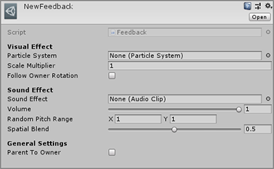
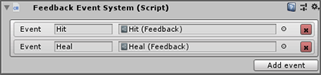
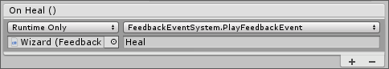

# Feedback System

## Unity easy configurable feedback system

The feedback system allow you to integrate and call feedbacks containing <b>visual and sound effects</b> easily with `Feedbacks` assets and `Feedback Event System`.

&nbsp;

## How to setup a feedback

Create a `Feedback` asset ("Create/Feedback") and refer the target `Particle System` and a `Audio Clip`.



Create a `Feedback Event System` on the target `Game Object`<br>



You can call those event with the method `PlayFeedbackEvent()` referencing the `Feedback Event System` in a `Unity Event`



or directly calling the `Play()` function of the feedback

```cs
using UnityEngine;
using SorangonToolset.FeedbackSystem;

public class Wizard : MonoBehaviour {
    [SerializedField] private Feedback _healFeedback = null;

    public void OnHeal(){
        _healFeedback.Play(transform.position, Quaternion.identity);
    }
}
```

&nbsp;

## Feedback Asset

&nbsp;

## Methods

<b>To use those methods, you must include `SorangonToolset.FeedbackSystem` namespace</b>

### `Feedback`

```cs
public void Play(Vector3 position, Transform owner = null)
```

Play the feedback at a position, refers the owner in the case you want your feedback depends to a parent.

---

```cs
public void Play(Vector3 position, Quaternion rotation, Transform owner = null)
```

Play the feedback at a position with a specific rotation, refers the owner in the case you want your feedback depends to a parent.

&nbsp;

### `Feedback Event System`

```cs
public void PlayFeedbackEvent(string eventName)
```

Plays the the target <b> event </b> from the `Feedback Event System`