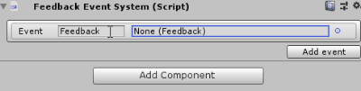

# Feedback System

## Unity easy configurable feedback system

The feedback system allow you to integrate and call feedbacks containing <b>visual and sound effects</b> easily with `Feedback` assets and `Feedback Event System` component.

&nbsp;

## How to setup a feedback

Create a `Feedback` asset ("Create/Feedback") and refer a target `Particle System` and a `Audio Clip`.


Add a `Feedback Event System` component on the target `Game Object`<br>



You can call those events with the method `PlayFeedbackEvent()` referencing the `Feedback Event System` in a `Unity Event`


or calling the `Play()` function of the feedback

```cs
using UnityEngine;
using SorangonToolset.FeedbackSystem;

public class Wizard : MonoBehaviour {
    [SerializedField] private Feedback _healFeedback = null;

    public void OnHeal(){
        _healFeedback.Play(transform.position, Quaternion.identity);
    }
}
```

&nbsp;

## Feedback Asset

In project window : <b>"Create/Feedback"</b>

<ul>
<li><b>Particle System</b> - The Particle System you want to play</li>
<li><b>Scale Multiplier</b> - The scale ratio of the instantiated particle system (set child particle system scaling mode to <b>Hierarchy</b> to scale it correctly)</li>
<li><b>Follow Owner Rotation</b> - Does the rotation of the effect is relative to the owner</li>
<li><b>Sound Effect</b> - The Audio Clip you want to play</li>
<li><b>Volume</b> - The volume of the sound effect</li>
<li><b>Random Pitch Range</b> - The range of the pitch value randomly generated between a min and a max</li>
<li><b>Spatial Blend</b> - Blend ratio between 2D or 3D space. If 1, the sound is played in the world space with a physical behaviour</li>
<li><b>Parent To Owner</b> - Does parent the visual and sound effect to the parent (if one is specifyied in Play() function parameters)</li>
</ul>

&nbsp;

## Methods

<b>To use those methods, you must include `SorangonToolset.FeedbackSystem` namespace</b>

&nbsp;

### `Feedback`

```cs
public void Play(Vector3 position, Transform owner = null)
```

Play the feedback at a position, refer the owner in the case you want your feedback depends to a parent.

---

```cs
public void Play(Vector3 position, Quaternion rotation, Transform owner = null)
```

Play the feedback at a position with a specific rotation, refer the owner in the case you want your feedback depends to a parent.

&nbsp;

### `Feedback Event System`

```cs
public void PlayFeedbackEvent(string eventName)
```

Play the the target <b> event </b> from the `Feedback Event System`